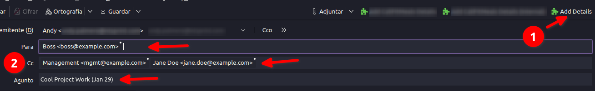

# Thunderbird Quick Compose Plugin

If you often send mails with similar details, this plugin is for you.

Let's say you send an email to your boss with copy to management and another person every day. The subject is "Cool Project Work" and the date. With this plugin, if you set this values in the code, you can do that with a single click:

## How to use

By default, this plugin does exactly what you see in the above picture, but you can and should tweak it according to your needs.

All the code is in `src/background.js`, there you can change `projectName`, `toArray`, `ccArray` and `subject` variables. You could set the body too, there are endless possibilities!

In `src/manifest.json` are the details about the plugin, adjust them.

In order to use the actual plugin, you can:

- Make a `.zip` file with `background.js` and `manifest.json` files, then rename it to `.xpi`. Or...
- Install this repository with `pnpm i` (`npm i` and `yarn` should work too), then run `pnpm build` (or `npm run build` or `yarn build`) and your plugin would be inside `dist` directory.

Once you have the `xpi` file, import it in Thunderbird and start using it.
